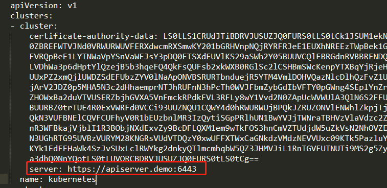
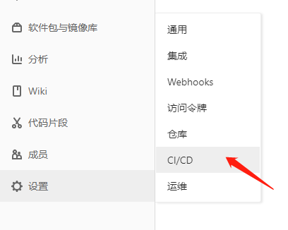
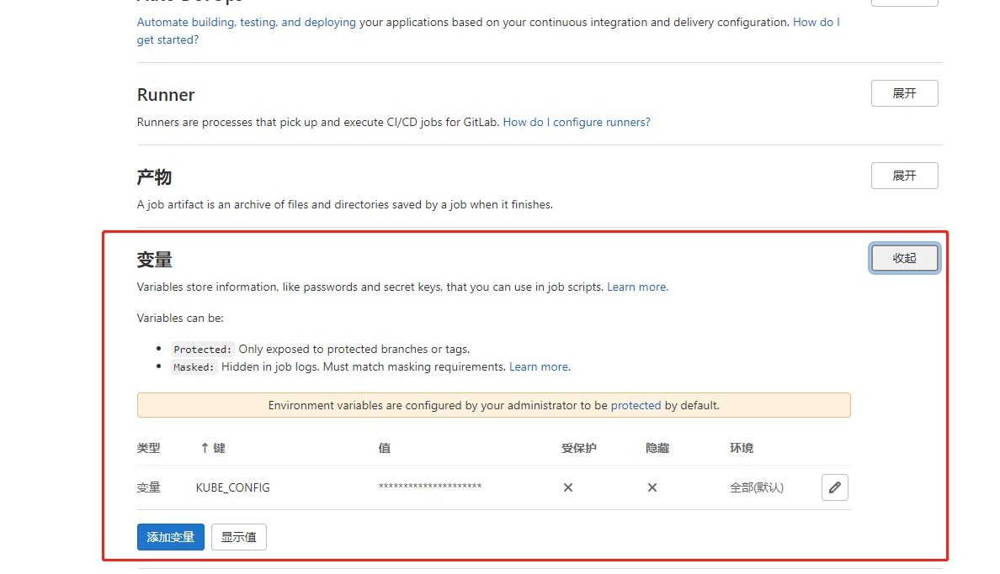
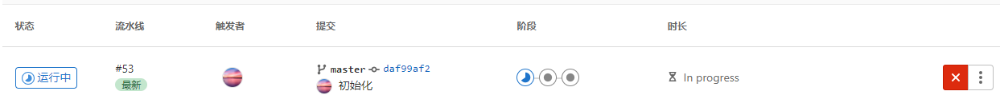
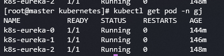
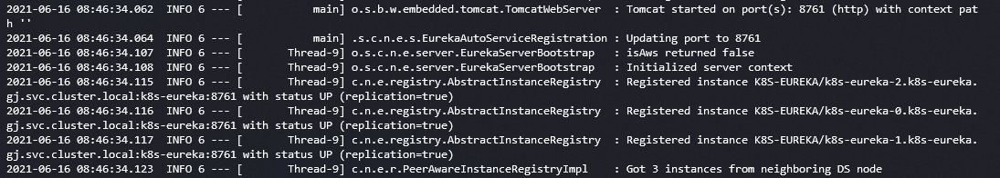

> 在k8s集群中通过CICD进行部署Eureka集群
## 一、背景
普通后端如果想要同时起多个服务来进行``负载均衡``，可以通过部署``Deployment``并调整``Pod``的数量，然后交由``Service``来代理这些``Pod``，
而对于``Eureka``而言，这样做就没那么方便了，因为``Eureka``之间还需要``互相注册``，因此需要做一些特殊的改动。
主要用到了``StatefulSet``和``Headless Service``这两个控制器
## 二、StatefulSet
这是一个用于管理有状态程序的控制器，它在管理``Pod``时，确保每一个``Pod``有一个``按顺序增长的ID``。它与``Deployment``相似，也是基于一个``Pod``模板进行管理其``Pod``，最大的不同在于
它始终给``Pod``分配不变的名称。
### 1、使用场景
* 稳定且唯一的网络标识，``Pod``重新调度后并不会更改``PodName``和``HostName``，基于``Headless Service``实现
* 稳定的持久化存储，每个``Pod``始终对应属于自己的存储，基于``PersistentVolumeClaimTemplate``
* 有序的增加(从0到N-1)、减少副本(从N-1到0)
* 按顺序的滚动更新
### 2、DNS格式
``StatefulSet``中每个``Pod``的DNS格式为
```
StatefulSetName-{0..N-1}.ServiceName.namespace.svc.cluster.local
```
* ``ServiceName``为``Headless Service``的名字
* ``0..N-1``为``Pod``所在的序号，从``0``开始到``N-1``
* ``StatefulSetName``为``StatefulSet``的名字
* ``namespace``为命名空间，``Headless Service和StatefulSet必须在相同的namespace``
* ``cluster.local``为``Cluster Domain``    

``如果Pod在同一个命名空间内，可以省略.namespace.svc.cluster.local``
### 3、HeadLess Service
``HeadLess Service``和普通的``Service``最大的区别在于它代理的``每一个Pod都会有对应一个域名``(上节提到的DNS格式)，在实际使用它的时候，我们需要将它的``clusterIP``属性设置为``None``
来表明它是一个``HeadLess Service``
## 三、搭建Eureka项目
### 1、创建项目
这里自行创建Eureka项目哦，这里不做演示
### 2、启动类增加注解
```java
/**
 * 增加@EnableEurekaServer来开启Eureka服务
 * @author Gjing
 */
@EnableEurekaServer
@SpringBootApplication
public class K8sEurekaDemoApplication {
    public static void main(String[] args) {
        SpringApplication.run(K8sEurekaDemoApplication.class, args);
    }
}
```
### 3、配置文件
这里使用了变量的形式设置配置的值，这样就可以根据不同的环境来分别配置了。如果对变量的使用不熟悉的话建议恶补一下SpringBoot项目在Yaml文件使用变量。这里只是演示的配置，在实际使用时
根据业务需求来合理配置
```yaml
server:
  port: ${EUREKA_HOST:8761}
spring:
  application:
    name: ${SERVER_NAME:k8s-eureka-demo}
eureka:
  client:
    # 从eureka获取注册信息
    fetch-registry: ${FETCH_EUREKA:false}
    # 注册自己
    register-with-eureka: ${REGISTER_EUREKA:false}
    # 服务注册中心地址
    service-url:
      defaultZone: ${EUREKA_URL:http://localhost:8761/eureka/}
  instance:
    # 当前实例的主机名称
    hostname: ${HOST_NAME:localhost}
  server:
    # 关闭安全模式
    enable-self-preservation: false
```
### 4、Dockerfile
```dockerfile
FROM openjdk:8-jdk
COPY target/*.jar app.jar
ENTRYPOINT java $JAVA_OPTS -jar $CONFIG app.jar
```
### 5、CI脚本文件
不是很熟悉CI写法的建议先看阅读：[SpringBoot使用CICD](https://www.jianshu.com/p/8764328efe21)
```yaml
before_script:
  - export IMAGE_FULL_NAME=${CI_REGISTRY_IMAGE}:${CI_COMMIT_REF_SLUG}-${CI_COMMIT_SHA}
stages:
  - compile
  - build
  - run
variables:
  MAVEN_REPO: "/.m2"
  PROJECT_NAME: "k8s-eureka"
  K8S_FILE: "eureka-k8s.yml"
compile:
  stage: compile
  image: 172.20.9.4:5001/gjing/maven:1.0
  only:
    - master
  tags:
    - pub
  script:
    - mvn -Dmaven.repo.local=$MAVEN_REPO clean package -Dmaven.test.skip=true
  artifacts:
    name: $PROJECT
    expire_in: 1week
    paths:
      - target/*.jar
build:
  stage: build
  image: docker:stable
  only:
    - master
  tags:
    - pub
  script:
    - docker login --username $CI_REGISTRY_USER --password $CI_REGISTRY_PASSWORD $CI_REGISTRY
    - docker build -t $IMAGE_FULL_NAME .
    - docker push $IMAGE_FULL_NAME
    - docker rmi -f $IMAGE_FULL_NAME
run:
  stage: run
  image: roffe/kubectl
  only:
    - master
  tags:
    - pub
  variables:
    PROJECT_PORT: 8761
    PROJECT_NAMESPACE: gj
  script:
    # 配置 kubectl, ${KUBE_CONFIG}这个变量会在下面发布的章节介绍如何配置
    - mkdir -p /root/.kube
    - echo ${KUBE_CONFIG} | base64 -d > /root/.kube/config
    - export KUBECONFIG=/root/.kube/config
    - kubectl version
    # 修改k8s文件里的一些变量
    - sed -i "s#{PROJECT_NAME}#$PROJECT_NAME#g;
      s#{PROJECT_PORT}#$PROJECT_PORT#g;
      s#{PROJECT_NAMESPACE}#$PROJECT_NAMESPACE#g;
      s#{PROJECT_IMAGE}#$IMAGE_FULL_NAME#g" $K8S_FILE
    # 创建
    - kubectl apply -f $K8S_FILE
```
### 6、项目的k8s文件
创建一个名为``eureka-k8s.yml``文件
```yaml
# 定义一个ConfigMap用于存储eureka的注册中心地址
apiVersion: v1 # 版本号
kind: ConfigMap # 类型
metadata: # 定义元数据，名称与命名空间
  name: eureka-host
  namespace: {PROJECT_NAMESPACE}
data: # 定义这个ConfigMap要存储的数据
  registry_url: http://{PROJECT_NAME}-0.{PROJECT_NAME}:{PROJECT_PORT}/eureka/,http://{PROJECT_NAME}-1.{PROJECT_NAME}:{PROJECT_PORT}/eureka/,http://{PROJECT_NAME}-2.{PROJECT_NAME}:{PROJECT_PORT}/eureka/
--- # 定义service
apiVersion: v1
kind: Service
metadata: # service的元数据，包含名称、命名空间、标签
  name: {PROJECT_NAME}
  namespace: {PROJECT_NAMESPACE}
  labels:
    app: {PROJECT_NAME}
spec: # 定义属性
  selector: # 需要代理的pod的标签
    app: {PROJECT_NAME}
  ports: # service的端口
    - port: {PROJECT_PORT}
      name: {PROJECT_NAME}
  clusterIP: None # 设置为None，表示我们这是一个Headless Service
--- # 定义一个StatefulSet
apiVersion: apps/v1
kind: StatefulSet
metadata: # 定义元数据，名称与命名空间
  name: {PROJECT_NAME}
  namespace: {PROJECT_NAMESPACE}
spec:
  replicas: 3 # 副本数
  serviceName: {PROJECT_NAME} # 服务名
  selector:
    matchLabels: # 匹配下方的template中定义的label
      app: {PROJECT_NAME}
  template: # 定义pod的模板
    metadata: # 模板的元数据
      labels:
        app: {PROJECT_NAME}
    spec: # 定义模板的属性
      containers:
        - name: {PROJECT_NAME}
          image: {PROJECT_IMAGE}
          ports:
            - containerPort: {PROJECT_PORT}
          readinessProbe: # 就绪检查
            httpGet:
              path: /actuator/health
              port: {PROJECT_PORT}
            failureThreshold: 3 # 探测失败的重试次数，如果超过3次了没成功就认定为pod是失败的状态
            initialDelaySeconds: 60 # pod启动延迟多久进行一次检查
            periodSeconds: 10 # 检测的时间间隔
            successThreshold: 1 # 只要一次成功就认为pod是正常的
            timeoutSeconds: 10 # 检测的超时时间，如果超时了就认为是失败的一个状态
          env: # 配置环境变量，传递给项目的配置文件
            - name: EUREKA_HOST
              value: "{PROJECT_PORT}"
            - name: SERVER_NAME
              value: {PROJECT_NAME}
            - name: FETCH_EUREKA
              value: "true"
            - name: REGISTER_EUREKA
              value: "true"
            - name: EUREKA_URL
              valueFrom:
                configMapKeyRef:
                  name: eureka-host
                  key: registry_url
            - name: HOST_NAME
              valueFrom:
                fieldRef:
                  fieldPath: metadata.name
```
这时候我们就所有的准备工作都完成了
## 四、发布
由于我们配了CI文件，那么当我们代码提交到Gitlab的时候，就会自动进行构建并启动啦
### 1、配置KUBE_CONFIG变量
首先，我们先登陆到 k8s master节点服务器上，进入到``/etc/kubernetes/``目录，然后通过``cat admin.conf``将这个文件的内容输出到控制台，最后将复制出来的内容先保存到
自己电脑的文本编辑器中，然后修改红色框中的地址，将``dns``修改为你的``ApiServer``的IP，如果是多master的话就是填写``ApiServer的LoadBalance IP了``       

    

然后我们复制修改后的所有内容，到浏览器随便搜索一个在线的base64加密工具将内容进行加密。随后，我们来到GitLab，进到具体项目或者项目组里，点击下方图中的选项   

    

点击后进到下方页面并添加变量，注意：``键``要和你ci里面写的保持一致，值的话就是刚刚加密后的内容了   

      

``最好将此变量配置在项目组中，这样该项目组的所有项目都会继承该变量``
### 2、提交
上面已经配置了``KUBE_CONFIG``变量了，这时候我们就可以直接提交代码到GitLab啦，提交成功后就可以在GitLab项目左侧的CICD选项中看到流水线在执行   

    

当三个阶段都打勾了就说明执行成功啦，如果出现了错误，那就可以点击指定阶段进去查看下错误日志进行针对性修改了   

   

这时我们可以去master服务器上执行命令查看下pod启动成功没    

    

可以看到三个``Pod``都是running状态了，这时我们也可以通过``kubectl logs -f k8s-eureka-0 -n gj``命令进行查看下其中一个``Pod``的日志，这里我们可以看到``Eureka``已经成功起来了   

